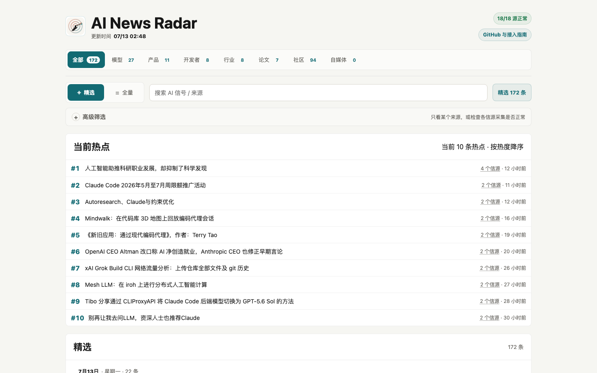
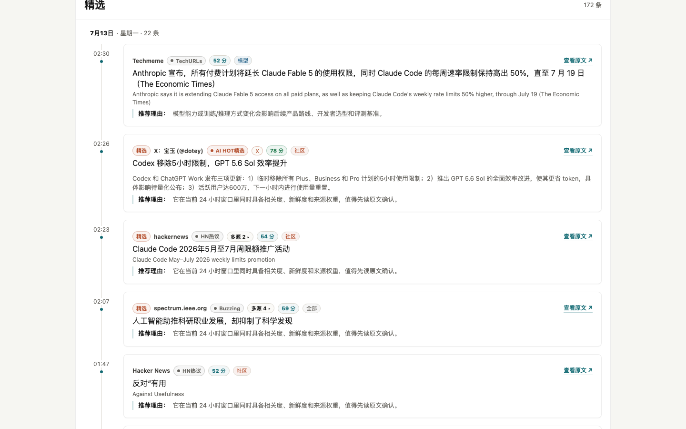
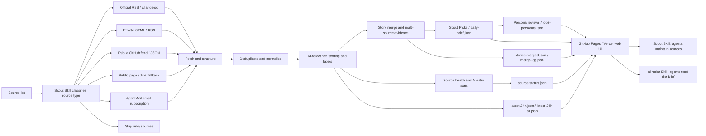

<div align="center">

# AI News Radar

## 24h AI Updates Radar｜Three-Persona Reviews

**It finds the thoroughbreds among your sources, merges scattered updates into story timelines, then reviews each day's headlines from three distinct personas.**

[](https://github.com/LearnPrompt/ai-news-radar/stargazers)
[](https://news.learnprompt.pro)
[](https://github.com/LearnPrompt/ai-news-radar/actions/workflows/update-news.yml)
[](skills/radar/README.md)
[](LICENSE)

```bash
npx skills add LearnPrompt/ai-news-radar -s ai-radar -g
```

Then ask your agent: `What happened in AI today?`

**Live site** → [news.learnprompt.pro](https://news.learnprompt.pro) (data source / fallback: [learnprompt.github.io/ai-news-radar](https://learnprompt.github.io/ai-news-radar/))

[中文](README.md) · [Radar Skill](skills/radar/README.md) · [Scout Skill](skills/ai-news-radar/README.md) · [Source strategy](docs/SOURCE_COVERAGE.md)

**What's new**: v0.9 collapses the UI into a single-layer information architecture (category tabs × curated/all toggle × chronological timeline). The old three-view screenshots are archived at [`/legacy/`](legacy/) and stay online until mid-August 2026.

</div>

---

## Pick your lane in 30 seconds

**① Let your agent read for you** → the install command above. One question, one brief. Zero API, zero key, zero server:


**② Read the site directly** → open [news.learnprompt.pro](https://news.learnprompt.pro). It defaults to a mobile view, with a "view" switch in the top-right corner to jump to the classic desktop UI at `/classic/`; you can also force a view with `?view=mobile` / `?view=classic` / `?view=auto`. Both views read the same `data/` directory. Since v0.9 the UI is a single layer: top category tabs (All/Models/Products/Devtools/Industry/Research/Community/Creator), a curated/all-items global toggle, and a chronological main list grouped by date. The "current hotspots" board has no fixed cap. Every curated card carries a one-line "why it matters" review, and stories that make the daily TOP3 expand inline into three-persona side-by-side reviews (Pragmatist, Cynic, Paper Police). When the same event is covered by multiple sources, the card collapses into a "N sources" chip you can expand.

**③ Fork and own your own filter** → fork this repo, swap in your own OPML sources, edit a markdown file under `personas/` to change the taste, and the data grows on your own GitHub Pages. Jump to the [fork guide](#fork-guide-your-own-radar-in-five-steps).

The three lanes are one road: let your agent read the brief → read the site yourself → run your own radar.

---

## What is this?

AI News Radar is an auto-updating 24h radar for AI updates. It does more than fetch AI news. It judges source quality first, merges the same event into a story timeline, has three personas score and review the picks, then uses Scout picks, AI labels, source health, and AI ratio to help you decide:

what is worth reading, what deserves deeper research, and what is just noise.

Readers can open the page and scan the last 24 hours of AI, model, and developer-tool updates. Developers can fork this repo and connect their own OPML/RSS, public feeds, static pages, or AgentMail inboxes. Codex / Claude Code-style agents can use the in-repo **Scout Skill** to judge new sources, maintain fetch logic, and deploy to GitHub Pages.

This project will never be "one more news page".

Its core logic is **Scout Skill**. It helps you find the thoroughbreds among a pile of sources. Which sources are worth tracking long term? Which ones should become RSS/OPML inputs? Which ones only make sense through a paid API? Which sources update all day, but have less than 5% AI signal for what you actually care about?

Judge first. Then connect.



## v0.9: single-layer IA + title enhancement

v0.8's three views (Scout Picks / AI Signal Flow / Hot board) are now one layer: one set of category tabs, one curated/all toggle, one timeline.



- **Dual view**: this single-layer IA now ships two UI skins — the root `index.html` defaults to mobile, and a "view" switch in the top-right corner jumps to the classic desktop skin at `/classic/`; both `?view=mobile` / `?view=classic` / `?view=auto` work directly as well. Both skins read the same `data/`, and the choice is remembered in local storage
- **Category tabs**: All/Models/Products/Devtools/Industry/Research/Community/Creator, mutually exclusive
- **Curated/all global toggle**: curated reads the merged, AI-relevant, high-value story pool; all reads the broader AI-relevant pool (`latest-24h-all.json`, score >= 0.3). Both modes share the same timeline + date-grouping template
- **Current hotspots board**: no fixed item cap — it shows however many stories clear the multi-source heat threshold, kept separate from the main list
- **Real, pipeline-generated reviews**: the one-line "why it matters" review on curated cards is now written by the pipeline itself — for items that already passed the AI-relevance filter, it fetches the full article and has DeepSeek write one sentence on why it's worth reading (requires `DEEPSEEK_API_KEY`). When there's no real review, the frontend simply hides that block instead of showing a template sentence. Stories that make the daily TOP3 still expand inline into all three persona reviews side by side, in a separate section of the card
- **Same-event expansion**: when 2+ sources cover the same event, the card shows an "N sources" chip — expand it to see each source's own title, outlet, and relative time
- **Title enhancement**: when a title is too terse or jargon-heavy, the pipeline micro-crawls the source page for context (falling back to r.jina.ai on direct-fetch failure) and has an LLM rewrite it. Requires `DEEPSEEK_API_KEY`; without it, titles stay as-is and nothing else breaks
- **Source-quality hardening**: the zeli aggregator (Hacker News 24h hot list) no longer gets a blanket allowlist pass — it now goes through the same AI-relevance scoring as every other aggregator. Bilingual title translation also gained validation: refusal-style outputs (e.g. "sorry, I can't process link content") and degenerate translations are detected and rejected, falling back to the original title instead of showing garbled text
- **Data-source switch**: append `?data=<data-dir-url>` to the page URL to point the frontend at a different `data/` directory (e.g. to preview another branch's or PR's generated data). The choice persists in local storage, handy for multi-branch development
- **aggregator sub-source classification**: items from aggregator sites get a further breakdown chip — X / WeChat / HN / RSS — right after the channel chip

## v0.8: three-persona reviews

Whether a story matters depends on who you are. v0.8 gives the daily brief swappable "tastes":

| Persona | id | Angle |
|---------|----|----|
| **Pragmatist** (default) | `pragmatic` | Only cares what practitioners can use today |
| **Cynic** | `cynic` | Punctures marketing spin and hype — sarcastic, but grounded in facts |
| **Paper Police** | `paper-police` | Only trusts papers/code/benchmarks; zero tolerance for "coming soon" |

- The daily 20 picks are scored and reviewed by the default persona; stories that make the daily TOP3 expand inline in their timeline card to show all three personas side by side — one story, three angles.
- Each persona is one markdown file under `personas/` (frontmatter + system prompt). Change the taste by editing one file; create a new one following [personas/README.md](personas/README.md) and PR it to join the built-in list.
- LLM reviews require a `DEEPSEEK_API_KEY` upstream. Without it the whole pipeline still runs — it degrades gracefully to rule-based scores, and both the site and the skill keep working.

## Why Scout Skill?

Good updates are scattered everywhere.

Official blogs publish one thing. Changelogs publish another. Someone drops an early signal on X. Aggregator sites keep reposting the same story.

I thought I was tracking the frontier. Most days, I was repeating the same three chores:

open dozens of pages, filter duplicates by hand, and guess which link was worth reading.

Let Scout Skill handle the first pass: **which sources are thoroughbreds, and which ones are noise**.

You can keep adding sources freely. You can also put a source into the input set, let it run for a week, and decide later whether it deserves to be promoted.

AI News Radar was never just about fetching information.

It is closer to a lightweight news pipeline: source judgement, fetching, deduplication, AI-relevance filtering, persona reviews, source health, and static web publishing. Once deployed, the core flow does not spend model tokens.

## What it can do

### For readers

- Use the "All/Models/Products/Devtools/Industry/Research/Community/Creator" category tabs to jump straight to what you care about
- Use the curated/all global toggle: curated shows high-value story timelines; switch to all when you need to backfill or search the broader AI-relevant pool
- The main list is sorted newest-first and grouped by day, so you can scan what happened today vs. yesterday at a glance; "current hotspots" is a separate, uncapped board for what's hottest right now
- Every curated card carries a one-line "why it matters" review, written by the pipeline itself — the block is simply hidden when there's no real review; stories in the daily TOP3 expand inline into all three persona reviews
- When the same event is covered by multiple sources, the card shows an "N sources" chip — expand it to read each source's own title instead of clicking through duplicates
- If a title reads like jargon or an abbreviation, sites with `DEEPSEEK_API_KEY` configured will show the LLM-rewritten, more complete version
- Locate updates quickly with the specific-source filter and keyword search
- Use source health and AI ratio to tell which sources are actually useful, and which ones update a lot but contain little AI signal

### For content creators

- Preserve original source links for deeper research, fact checking, and topic planning
- Multiple sources covering the same event collapse into the card's "N sources" chip — expand it to compare each outlet's own title and wording, reducing duplicate reading
- Use AI labels to judge whether an item is better for a post, short video, or hands-on tool test
- Use signals such as multi-source overlap, official-first source, and single-source watch item to judge topic credibility and priority
- Persona reviews double as topic research: the Pragmatist says it's useful, the Cynic says it's spin, the Paper Police says there's no evidence — the disagreement itself is content

### For developers and agents

- Requires no API key, login state, or LLM quota by default
- Supports official RSS/changelog sources, OPML/RSS, public GitHub feed/JSON files, static pages, and AgentMail
- GitHub Actions automatically generates `data/*.json` and publishes to GitHub Pages
- Codex / Claude Code / Hermes / OpenClaw can use the in-repo Scout Skill to maintain sources, fetch logic, and the web page
- For local or multi-branch development, use the page's `?data=` query param to point the frontend at a different `data/` directory without touching code or redeploying
- Advanced sources can be connected through GitHub Secrets or local environment variables, without committing tokens, cookies, private OPML files, or email bodies

## How it works



AI News Radar borrows from modern newsroom workflows. Dumping thousands of items into a page is not useful, so the project turns news handling into a stable pipeline: fetch, deduplicate, filter, review, enrich with status, and generate a static site.

It stays lightweight on purpose. The public version does not require an LLM API key, login state, cookies, X API access, or email access. When you need advanced sources, Scout Skill can connect them through GitHub Secrets or local environment variables.

## Data outputs

Each update generates a set of static JSON files. The page only reads these files and does not need a backend service. GitHub Pages is the canonical data source; the Vercel site is just another front for the same data.

Core files include:

- `data/daily-brief.json`: Scout Picks — 20 daily items; since v0.8 each carries persona score and review fields
- `data/top3-personas.json`: the daily TOP3 with all three persona reviews side by side
- `data/latest-24h.json`: AI-focused updates from the last 24 hours
- `data/latest-24h-all.json`: broadly AI-relevant updates from the last 24 hours (score >= 0.3)
- `data/latest-24h-all-raw.json`: unfiltered raw items from the last 24 hours (dev-only, not wired into the frontend)
- `data/source-status.json`: source fetch status, success rate, site coverage, and source health
- `data/stories-merged.json`: the complete merged story set
- `data/merge-log.json`: story-merge matches and debug records for auditing

If `daily-brief.json` is not available yet, the page falls back to candidate Scout signals; if `stories-merged.json` exists, the page uses the full story pool to extend the timeline beyond the picks.

## Fork guide: your own radar in five steps

1. **Fork** [LearnPrompt/ai-news-radar](https://github.com/LearnPrompt/ai-news-radar).
2. **Enable Actions**: GitHub pauses workflows on forks by default — enable them on the Actions tab, and `update-news.yml` runs every 30 minutes.
3. **(Optional) Add `DEEPSEEK_API_KEY`**: Settings → Secrets and variables → Actions. This unlocks persona reviews, title enhancement, real pipeline-generated review lines for curated items, and more reliable Chinese title translation (refusal text and degenerate output fall back to the original title automatically). Without it everything still runs — rule-based scores, original titles, and Google Translate take over, and the review block simply doesn't render. The default model is `deepseek-v4-flash`; set a repo Variable `DEEPSEEK_MODEL` if you want a different one. Add `TITLE_ENHANCE_MAX_PER_RUN` too if you want to cap how many titles get rewritten per run (defaults to 30).
4. **Enable GitHub Pages**: Settings → Pages, serve the master branch root. Your radar is live minutes later.
5. **Change one line in the skill**: point the `BASE_URL` at the top of `skills/radar/SKILL.md` to `https://<your-username>.github.io/ai-news-radar/data`, and your agent reads your data from now on.

To change sources: put your subscriptions into `feeds/follow.opml` (see `feeds/follow.example.opml`), or let the in-repo [Scout Skill](skills/ai-news-radar/README.md) judge and ingest them. To change tastes: edit the markdown files under `personas/`. Unhappy with a translation: edit `translation-glossary.txt` in the repo root (protected terms + repair rules, format documented in the file) and the next pipeline run picks it up. Want your own domain: (optional) import the repo into Vercel — the included `vercel.json` is ready, zero build. Want to preview data from another branch while testing: append `?data=<data-dir-url>` to the page URL, no code changes needed.

## Quick start (run locally)

Readers do not need to install anything. Open the live site directly.

To fork and customize your own version locally:

```bash
git clone https://github.com/LearnPrompt/ai-news-radar.git
cd ai-news-radar
python3 -m venv .venv
source .venv/bin/activate
pip install -r requirements.txt
python scripts/update_news.py --output-dir data --window-hours 24
python -m http.server 8080
```

Open:

```text
http://localhost:8080
```

If you have your own OPML:

```bash
cp feeds/follow.example.opml feeds/follow.opml
# Put your own subscriptions into feeds/follow.opml. Do not commit this file.
python scripts/update_news.py --output-dir data --window-hours 24 --rss-opml feeds/follow.opml
```

## Tutorial for agents

If you want Codex / Claude Code / OpenClaw / Hermes to help you build your own version, say:

```text
Use Scout Skill for AI News Radar. Ask me for my source list first, then decide whether each source should use RSS, public feeds, static pages, Jina fallback, AgentMail email, or be skipped. The goal is to deploy a serverless AI daily news site that updates automatically with GitHub Actions. Do not commit any API keys, cookies, tokens, or private email content into the repo.
```

The repo ships two skills — the radar reads, the scout selects:

- `skills/radar/`: **ai-radar** (consumer side) — install without forking, ask AI news questions in natural language, get a brief from this site's public JSON
- `skills/ai-news-radar/`: **Scout Skill** (maintainer side) — after forking, use it to classify sources, maintain fetch logic, and deploy GitHub Pages

When a new agent takes over validation, read these first:

- `README.md`
- `README.en.md`
- `docs/GPT_HANDOFF.md`
- `docs/SOURCE_COVERAGE.md`
- `docs/V2_PRODUCT_BRIEF.md`

## GitHub Actions updates

`.github/workflows/update-news.yml` is already configured.

- Supports manual `workflow_dispatch`; pass `force_tikhub=true` explicitly to override the normal paid-source interval for TikHub
- Runs every 30 minutes by default: `*/30 * * * *`
- Automatically generates and commits `data/*.json`
- With `DEEPSEEK_API_KEY` set, scores the daily picks with the default persona, generates the three-persona TOP3 reviews, enables title enhancement, generates real pipeline-written review lines for curated items, and gives better translation (refusal text and degenerate output fall back to the original title automatically); without it, falls back to rule-based scores, original titles, and Google Translate, and the review block doesn't render — the core pipeline still runs
- Default DeepSeek model is `deepseek-v4-flash` (DeepSeek is retiring the `deepseek-chat` alias on 2026-07-24); set a repo Variable `DEEPSEEK_MODEL` to override it
- With `TITLE_ENHANCE_MAX_PER_RUN` set, caps how many titles get rewritten per run; defaults to 30
- Uses public demo `feeds/follow.example.opml` when `FOLLOW_OPML_B64` is not configured, so the hosted page can show the RSS/OPML path working
- Decodes `FOLLOW_OPML_B64` into private `feeds/follow.opml` when configured
- Generates a redacted email summary when `EMAIL_DIGEST_ENABLED=1`, `AGENTMAIL_API_KEY`, and `AGENTMAIL_INBOX_ID` are set
- Commits `data/email-digest.json` only when `EMAIL_DIGEST_PUBLISH=1` is also explicitly set
- Uses the official X API during the configured daily UTC window when `X_API_ENABLED=1`, `X_BEARER_TOKEN`, and budget variables are set. This is off by default, and the current X API charges by returned resources.
- Fetches a small number of public X/Twitter search results through SocialData.tools when `SOCIALDATA_ENABLED=1`, `SOCIALDATA_API_KEY`, and budget variables are set, at `SOCIALDATA_RUN_INTERVAL_HOURS` (default 12h) intervals. Off by default; keep the API key in local env vars or GitHub Secrets only.
- Fetches a small number of Douyin/Xiaohongshu keyword results through TikHub when `TIKHUB_ENABLED=1`, `TIKHUB_API_KEY`, and budget variables are set, at `TIKHUB_RUN_INTERVAL_HOURS` (default 24h) intervals. Off by default; keep the API key in local env vars or GitHub Secrets only.
- Paid-source intervals are tracked in `data/paid-source-state.json` — it stores only the last run time, result count, and error name, never API keys. When the half-hourly workflow skips paid sources, old items stay in `data/archive.json` instead of being dropped.

By default, the core pipeline requires no API keys.

The "updated at" time in the top-right corner of the live page comes from `generated_at` in `data/latest-24h.json`. If the page is stuck on an old time, first check whether the latest `Update AI News Snapshot` run in GitHub Actions succeeded, whether it hit fetch errors, and whether Pages deploys from the branch containing the latest `data/` commit.

Advanced source templates live in `examples/advanced-sources.env.example`.

Budget notes are in `docs/research/advanced-source-free-tier-budget-2026-05-10.md`.

The X API demo config is in `docs/guides/x-api-demo-config.md`.

The single-account / single-newsletter demo is in `docs/guides/rileybrown-alphasignal-demo.md`.

## Version history

| Version | The question it answers | Key capabilities |
|---------|------------------------|------------------|
| v0.6 | How do scattered messages become events? | Story merging, AI labels/scores, source health and AI ratio |
| v0.7 | With this many stories, what's hot? | Hot view (multi-source mass × time decay), community section, headline-style Top3, quality-over-quantity gate, scoring backtest tool, ai-radar consumer skill |
| v0.8 | Same story — whose take do you trust? | Three-persona reviews, TOP3 side-by-side, persona-as-markdown-file (editable, PR-able), Vercel public site |
| v0.9 | Three views coexist — how do they read as one news feed? | Single-layer IA (category tabs × curated/all × timeline), mobile/classic dual view, real pipeline-generated reviews, title enhancement, source-quality hardening, same-event multi-source expansion, data-source switching, aggregator sub-source classification |

See [Releases](https://github.com/LearnPrompt/ai-news-radar/releases) for the full history.

## Acknowledgements

- [AI HOT](https://aihot.virxact.com): Chinese AI news aggregator, one of the sources
- [superpowers](https://github.com/obra/superpowers): skill engineering methodology
- [mattpocock/skills](https://github.com/mattpocock/skills): skill writing methodology

## License

[MIT](LICENSE)

---

<div align="center">

**更多好用 Skill · More Skills** → [learnprompt.pro/skills](https://learnprompt.pro/skills/)

[鲁班·Skill打磨](https://github.com/LearnPrompt/luban-skill) · [庖丁·博主蒸馏](https://github.com/LearnPrompt/paoding-skill) · [蔡伦·对话造纸](https://github.com/LearnPrompt/cailun-skill) · [阿福·LLM Todo](https://github.com/LearnPrompt/afu-llm-todo) · [愚公·Loop工程](https://github.com/LearnPrompt/loop-engineering) · [搭子·结对开发](https://github.com/LearnPrompt/partner-skill) · [AI雷达·零API资讯](https://github.com/LearnPrompt/ai-news-radar)

[淘金小镇·ClawHub日榜](https://github.com/LearnPrompt/skillrush-town) · [Irasutoya·正文配图](https://github.com/LearnPrompt/carl-irasutoya-illustrations) · [Humanize PPT·演讲系统](https://github.com/LearnPrompt/humanize-ppt) · [CC Harness·六件套](https://github.com/LearnPrompt/cc-harness-skills) · [微信读书教练](https://github.com/LearnPrompt/carl-weread) · [X Article发布](https://github.com/LearnPrompt/x-article-publisher-skill)

<sub>**[LearnPrompt](https://github.com/LearnPrompt) 出品** · 公众号「卡尔的AI沃茨」 · [X @aiwarts](https://x.com/aiwarts)</sub>

</div>
