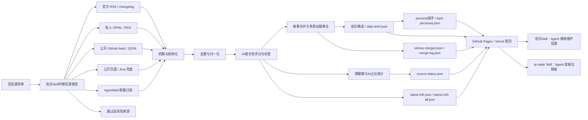

<div align="center">

# AI News Radar

## 24小时AI更新雷达｜三口味锐评

**先帮你从一堆信源里选出千里马，再把分散消息合并成故事线，最后用三种口味替你锐评每日头条。**

[](https://github.com/LearnPrompt/ai-news-radar/stargazers)
[](https://news.learnprompt.pro)
[](https://github.com/LearnPrompt/ai-news-radar/actions/workflows/update-news.yml)
[](skills/radar/README.md)
[](LICENSE)

```bash
npx skills add LearnPrompt/ai-news-radar -s ai-radar -g
```

装完对Agent说一句：`今天AI圈有什么？`

**在线站** → [news.learnprompt.pro](https://news.learnprompt.pro)（数据源/备用：[learnprompt.github.io/ai-news-radar](https://learnprompt.github.io/ai-news-radar/)）

[English](README.en.md) · [雷达Skill](skills/radar/README.md) · [伯乐Skill](skills/ai-news-radar/README.md) · [信息源策略](docs/SOURCE_COVERAGE.md)

**更新说明**：v0.9 把界面收敛成单层信息架构（栏目 tab × 精选/全量 × 时间轴），旧的三视图截图存档于 [`/legacy/`](legacy/)，保留至 2026 年 8 月中旬。

</div>

---

## 30秒选边上车

**① 让Agent替你读报** → 上面那行安装命令，装完一句话拿简报，零API、零Key、零服务器：


**② 直接看网页** → 打开 [news.learnprompt.pro](https://news.learnprompt.pro)。默认是手机版视图，右上角「视角」开关能切到经典版（旧版桌面界面，路径 `/classic/`），也可以直接用 `?view=mobile` / `?view=classic` / `?view=auto` 指定，两个视图读同一份 `data/` 目录数据。v0.9 起是单层信息架构：顶部「全部/模型/产品/开发者/行业/论文/社区/自媒体」栏目 tab + 「精选/全量」全局开关，主列表按时间倒序、按日分组，「当前热点」榜不设固定条数单独看当下最热。每条精选卡片自带一句话「推荐理由」，命中当日 TOP3 的故事还能展开实用派、毒舌评论员、论文警察三种口味并排锐评；同一事件被多家信源报道时会折叠成「多源 N」标签，点开看每家独立标题。

**③ fork 拥有自己的筛子** → fork本仓库，信源换成你自己的 OPML，口味改 `personas/` 下的 markdown 文件，数据长在你自己的 GitHub Pages 上。跳到[fork 指南](#fork-指南五步拥有自己的雷达)。

三层是一条路：让Agent读报 → 自己看报 → 自己办报。

---

## 这是什么

AI News Radar是一个自动更新的24小时AI更新雷达。它不只是把AI新闻抓回来，会先判断信息源质量，把同一个事件合并成故事线，再用三种口味的 persona 替你打分点评，最后用伯乐精选、AI标签、源健康和AI占比帮你判断：

什么信息值得看，什么值得深挖，什么只是噪音。

普通用户直接打开网页，看最近24小时AI、模型、开发者工具和技术生态更新。开发者可以fork这个仓库，接入自己的OPML/RSS、公开feed、静态页面或AgentMail邮箱。Codex / Claude Code这类 Agent 可以使用项目内置的 **伯乐Skill**，继续帮你判断新的信息源、维护抓取逻辑、部署 GitHub Pages。

这个项目永远都不会是"又一个新闻网页"。

它的核心逻辑是**伯乐Skill**，帮你从一堆信源里选出千里马。哪些源值得长期追踪，哪些源适合做成RSS/OPML，哪些源只能接付费的API，哪些源看起来更新很多但实际上跟你长期关注的方面比方AI只占了里面的5%不到。

先判断清楚，再接入。


## v0.9：单层信息架构 + 标题增强

v0.8 的三视图（伯乐精选 / AI信号流 / 热点榜）合并成了一层：一套栏目 tab + 一个精选/全量开关 + 一条时间轴。


- **双视图**：这套单层架构现在有两套 UI 皮肤——根目录 `index.html` 默认手机版，右上角「视角」开关可切到 `/classic/` 经典桌面版，也支持 `?view=mobile` / `?view=classic` / `?view=auto` 参数直接指定；两套皮肤读同一份 `data/`，选择记在浏览器本地
- **栏目 tab**：全部/模型/产品/开发者/行业/论文/社区/自媒体，互斥单选
- **精选/全量全局开关**：精选读故事合并后的AI强相关高价值池，全量读广义AI相关的原始池（`latest-24h-all.json`，score >= 0.3），两种模式共用同一套时间轴+日期分组模板
- **当前热点**：不设固定条数，只要满足多信源热度阈值就上榜，跟主列表分开单独看
- **推荐理由真实化**：精选条目的一句话推荐理由由管线侧真实生成——对过了 AI 相关性筛选的条目抓取全文，交给 DeepSeek 写一句「为什么值得读」（需要 `DEEPSEEK_API_KEY`）；没有真实理由时前端直接隐藏这个区块，不再用模板句撑场面。命中当日 TOP3 的故事另外在卡片内展开三口味并排锐评，不再是单独的首页板块
- **同一事件展开**：同一事件被 2 家以上信源报道时，卡片上出现「多源 N」标签，点开看每家独立标题、来源和相对时间
- **标题增强**：标题过短或黑话过多时，会拿原文上下文（自家抓取失败时回退到 r.jina.ai）交给 LLM 改写得更完整；配 `DEEPSEEK_API_KEY` 才生效，没配就保留原标题，不影响其余流程
- **源质量加固**：聚合源 zeli（Hacker News 24h 热榜）取消整榜白名单放行，改成和其他聚合源一样过同一套 AI 相关性打分；双语标题翻译新增校验，拒答文案（比如「抱歉，我无法处理链接内容」）和退化输出会被识别并回退到原文标题，不会把车轱辘话当标题显示
- **数据同源开关**：给页面 URL 加 `?data=<data目录地址>` 可以让前端读取另一份 `data/`（比如验证另一个分支或 PR 生成的数据），选择会记在浏览器本地，方便多分支开发时来回切换
- **聚合源子来源分类**：聚合站点条目会按原始平台再细分成 X / 公众号 / HN / RSS 小标签，紧跟在来源 chip 之后

## v0.8：三口味 persona 锐评

同一条新闻，值不值得看取决于你是谁。v0.8 给日报装上了可换的"口味"：

| 口味 | id | 视角 |
|------|----|----|
| **实用派**（默认） | `pragmatic` | 只关心对开发者/从业者今天有什么用 |
| **毒舌评论员** | `cynic` | 拆穿营销话术和炒作，讥讽但基于事实 |
| **论文警察** | `paper-police` | 只认论文/代码/benchmark 实证，对"即将推出"零容忍 |

- 每日精选20条按默认口味打分点评，命中当日 TOP3 的故事在时间轴卡片里直接展开三味并排，一条新闻三个角度。
- 每个口味就是 `personas/` 目录下的一个 markdown 文件（frontmatter + system prompt）。想换口味，改一个文件；想造新口味，照 [personas/README.md](personas/README.md) 的格式写一个，PR 过来就能进内置列表。
- 上游配了 `DEEPSEEK_API_KEY` 才有 LLM 点评；不配也能跑全流程，自动降级成规则分，页面和 Skill 都正常工作。

## 为什么需要伯乐Skill

好新闻分散在各处，

官方博客发一点，更新日志发一点，X上有人提前爆料，聚合站又把同一个新闻转来转去。

我以为的自己在追前沿，实际每天都在重复三件事，

打开几十个页面，肉眼+人脑过滤重复内容，猜哪条值得看。

让伯乐Skill先替你完成第一轮判断，**哪些信源是千里马，哪些是噪音**。

你可以随意增加信息源，还可以把一个信息源纳入输入范围，先让它在单独运行一周，再判断要不要录入。

AI News Radar从来都不是单纯把信息抓回来，

它更像是一条轻量的新闻pipeline，把来源判断、抓取、去重、AI强相关过滤、persona锐评、信息源健康状态和静态网页发布串起来，上线后核心流程不消耗模型额度。

## 能做什么

### 给普通读者

- 打开在线页面，用「全部/模型/产品/开发者/行业/论文/社区/自媒体」栏目 tab 快速定位关心的方向
- 用「精选/全量」全局开关切换：精选看高价值故事线，需要补盲或检索时切到全量的广义AI相关原始池
- 主列表按时间倒序、按日分组，一屏看清楚今天/昨天分别更新了什么；「当前热点」榜单独看当下最热，不设固定条数
- 每条精选卡片带一句话「推荐理由」（管线侧真实生成，没有理由时这块不显示）；命中当日 TOP3 的故事还能展开三口味 persona 并排锐评
- 同一事件被多家信源报道时，卡片上会出现「多源 N」标签，点开看每家独立标题，不用分别点进重复新闻
- 标题看不懂缩写或黑话时，配了 `DEEPSEEK_API_KEY` 的站点会用改写后的完整标题
- 用具体来源和关键词搜索快速定位信息
- 通过源健康和AI占比判断：哪些源是真有料，哪些源更新很多但AI含量低

### 给内容创作者

- 保留原始来源链接，方便继续深挖、核对事实和做选题
- 同一个事件的多个来源折叠进卡片的「多源 N」标签，点开看每家独立标题，减少重复阅读也方便比对措辞差异
- 用AI标签快速判断一条消息适合做图文、短视频、还是工具实测
- 用多源重合、官方一手、单源观察等信号判断选题可信度和优先级
- 三口味点评天然是选题参考：实用派说有用、毒舌说有诈、论文警察说没证据，分歧本身就是内容

### 给开发者和Agent

- 默认不需要 API Key、不需要登录态、不需要 LLM额度
- 支持官方 RSS/changelog、精选 AI 媒体 RSS、OPML/RSS、公开 GitHub feed/JSON、静态页面、AgentMail 等来源类型
- GitHub Actions自动生成 `data/*.json` 并发布到 GitHub Pages
- Codex / Claude Code / Hermes / OpenClaw 可以通过项目内置的伯乐Skill继续维护信源、抓取逻辑和页面
- 本地/多分支开发可以用页面 `?data=` 参数切换前端读取的 `data/` 目录，不用来回改代码或部署
- 高级来源可以通过 GitHub Secrets或本地环境变量接入，避免把 token、cookies、私有 OPML 和邮箱正文写进仓库

## 工作原理



AI News Radar学习了现代新闻学的技术，不是简单堆信息源，一次性放几万条信息出来等于没用，所以我选择把新闻处理拆成稳定pipeline，抓取，去重，过滤，锐评，补充状态，生成静态站点。

在保证稳定性的同时追求轻量化，公开版不要求用户配置LLM API Key，不依赖登录态，cookies，X API和邮箱。需要这些进阶能力时，可以通过伯乐Skill用GitHub Secrets或本地环境变量接入。

## 数据产物

每次更新会生成一组静态JSON文件，页面只读取这些文件，不需要后端服务。GitHub Pages 是数据的 canonical 源，Vercel 站只是同一份数据的另一个门面。

核心文件包括：

- `data/daily-brief.json`：伯乐精选20条日报成品，v0.8 起含 persona 打分与点评字段
- `data/top3-personas.json`：每日 TOP3 的三口味点评并排
- `data/latest-24h.json`：最近24小时AI强相关消息
- `data/latest-24h-all.json`：最近24小时广义AI相关消息（score >= 0.3）
- `data/latest-24h-all-raw.json`：最近24小时零过滤全量消息（dev-only，不接入前端UI）
- `data/source-status.json`：来源抓取状态、成功率、站点覆盖和源健康
- `data/stories-merged.json`：故事合并后的完整事件集合
- `data/merge-log.json`：故事合并过程和命中记录，方便调试与审计

如果 `daily-brief.json` 暂时不存在，页面会回退到候选信号列表；如果 `stories-merged.json` 存在，页面会用完整故事池补齐后续故事线，避免只有少量精选故事被接入。

## Fork 指南：五步拥有自己的雷达

1. **Fork** [LearnPrompt/ai-news-radar](https://github.com/LearnPrompt/ai-news-radar)。
2. **开 Actions**：fork 后 GitHub 默认暂停 workflow，去 Actions 页点一下启用，`update-news.yml` 每30分钟自动跑。
3. **（可选）配 `DEEPSEEK_API_KEY`**：Settings → Secrets and variables → Actions 加一个 secret，就能获得 persona 锐评、标题增强、精选条目的真实推荐理由，以及更可靠的中文标题翻译（拒答文案和退化输出会自动回退原标题）。不配也全流程能跑，自动降级成规则分、原始标题加谷歌翻译，推荐理由区块直接不显示。默认模型是 `deepseek-v4-flash`，需要换模型可以另配一个 Variable `DEEPSEEK_MODEL` 覆盖。想控制每次运行改写多少条标题，可以再配一个 `TITLE_ENHANCE_MAX_PER_RUN`（不配默认 30）。
4. **开 GitHub Pages**：Settings → Pages，选 master 分支根目录。几分钟后你的雷达就活了。
5. **改 skill 一行**：把 `skills/radar/SKILL.md` 顶部的 `BASE_URL` 换成 `https://<你的用户名>.github.io/ai-news-radar/data`，你的 Agent 从此读你自己的数据。

想换信源：把订阅写进 `feeds/follow.opml`（参考 `feeds/follow.example.opml`），或让内置[伯乐Skill](skills/ai-news-radar/README.md)帮你判断和录入。想换口味：改 `personas/` 下的 markdown 文件。翻译不满意：改根目录 `translation-glossary.txt`（保护术语 + 修正规则，文件内有格式说明），下次管线运行自动生效。想要自己的域名：（可选）把仓库 import 进 Vercel，仓库里的 `vercel.json` 已配好，零构建直接上线。想在验证阶段临时看另一份数据（比如自己分支跑出来的 `data/`）：给页面 URL 加 `?data=<data目录地址>` 即可，不用改代码。

## 快速开始（本地运行）

普通用户不用安装，直接打开在线页面即可。

想fork改造新版本，可以本地运行：

```bash
git clone https://github.com/LearnPrompt/ai-news-radar.git
cd ai-news-radar
python3 -m venv .venv
source .venv/bin/activate
pip install -r requirements.txt
python scripts/update_news.py --output-dir data --window-hours 24
python -m http.server 8080
```

打开：

```text
http://localhost:8080
```

如果你有自己的 OPML：

```bash
cp feeds/follow.example.opml feeds/follow.opml
# 把自己的订阅源写进 feeds/follow.opml，不提交这个文件
python scripts/update_news.py --output-dir data --window-hours 24 --rss-opml feeds/follow.opml
```

## 给Agent看的教程

如果你想让Codex / Claude Code / OpenClaw / Hermes帮你搭自己的版本，可以直接说：

```text
请使用伯乐Skill，先问我要信息源清单，然后帮我判断每个信源该用RSS、公开feed、静态页面、Jina兜底、AgentMail邮箱还是跳过。目标是部署一个不需要服务器、能用GitHub Actions自动更新的 AI 日报网站。不要把任何API Key、cookies、token、私有邮件内容写入仓库。
```

项目内置两个 Skill，分工是「雷达管读，伯乐管选」：

- `skills/radar/`：**ai-radar 雷达Skill**（消费侧）——不用fork就能装，自然语言问AI资讯，读本站公开JSON出简报
- `skills/ai-news-radar/`：**伯乐Skill**（维护侧）——fork后用它录入信源、维护抓取逻辑、部署 GitHub Pages

新Agent接手验收时，推荐先读：

- `README.md`
- `README.en.md`
- `docs/GPT_HANDOFF.md`
- `docs/SOURCE_COVERAGE.md`
- `docs/V2_PRODUCT_BRIEF.md`

## GitHub 自动更新

`.github/workflows/update-news.yml` 已经配置好定时任务。

- 支持手动触发 `workflow_dispatch`；需要忽略 TikHub 的正常付费源间隔时，显式传入 `force_tikhub=true`
- 默认每 30 分钟运行一次：`*/30 * * * *`
- 自动生成并提交 `data/*.json`；工作流使用 `git add data/`，避免新增 JSON 文件因为白名单遗漏而停留在旧更新时间
- 如果设置 `DEEPSEEK_API_KEY`，会给每日精选打 persona 分、生成三口味 TOP3 点评、启用标题增强、生成精选条目的真实推荐理由，并给出更可靠的中文翻译（拒答文案和退化输出会自动回退原标题）；不设置时自动降级为规则分、原始标题和谷歌翻译，推荐理由区块不显示，核心流程照样跑
- 默认 DeepSeek 模型是 `deepseek-v4-flash`（DeepSeek 官方将于 2026-07-24 弃用 `deepseek-chat` 别名），可以设置仓库 Variable `DEEPSEEK_MODEL` 覆盖
- 如果设置 `TITLE_ENHANCE_MAX_PER_RUN`，会限制每次运行最多改写的标题条数；不设置默认 30
- 如果没有设置 `FOLLOW_OPML_B64`，线上工作流会自动使用公开示例 `feeds/follow.example.opml`，让页面展示 RSS/OPML 能力
- 如果设置 `FOLLOW_OPML_B64`，会优先自动解码为私有 `feeds/follow.opml`
- 如果设置 `EMAIL_DIGEST_ENABLED=1`、`AGENTMAIL_API_KEY`、`AGENTMAIL_INBOX_ID`，会生成脱敏邮箱摘要
- 只有额外设置 `EMAIL_DIGEST_PUBLISH=1`，才会提交 `data/email-digest.json`
- 如果设置 `X_API_ENABLED=1`、`X_BEARER_TOKEN` 和预算变量，会在每日指定UTC窗口用官方X API抓取少量公开Post；默认关闭，且当前X API按返回资源计费
- 如果设置 `SOCIALDATA_ENABLED=1`、`SOCIALDATA_API_KEY` 和预算变量，会按 `SOCIALDATA_RUN_INTERVAL_HOURS`（默认12小时）通过 SocialData.tools 抓取少量公开 X/Twitter 搜索结果；默认关闭，API Key 只应放在本地环境变量或 GitHub Secrets
- 如果设置 `TIKHUB_ENABLED=1`、`TIKHUB_API_KEY` 和预算变量，会按 `TIKHUB_RUN_INTERVAL_HOURS`（默认24小时）通过 TikHub 抓取少量抖音/小红书关键词搜索结果；默认关闭，API Key 只应放在本地环境变量或 GitHub Secrets
- SocialData/TikHub 的拉取间隔会记录在 `data/paid-source-state.json`，只保存上次运行时间、结果数和错误名，不保存 API Key；半小时工作流跳过付费源时，旧条目仍保留在 `data/archive.json`，不会因为本轮未拉取就被清空

默认情况下，本项目不需要任何API Key就能跑核心流程。

线上页面右上角显示的"更新时间"来自 `data/latest-24h.json` 的 `generated_at`。如果页面长时间停在旧时间，优先检查 GitHub Actions 最近一次 `Update AI News Snapshot` 是否运行、是否有抓取错误、以及仓库 Pages 是否部署到包含最新 `data/` 提交的分支。

高级源配置模板见 `examples/advanced-sources.env.example`，

预算说明见 `docs/research/advanced-source-free-tier-budget-2026-05-10.md`，

本地测试 TikHub 抓取时可以先小流量强制跑一次：

```bash
export TIKHUB_ENABLED=1
export TIKHUB_API_KEY='你的 TikHub API Key'
export TIKHUB_FORCE_RUN=1
export TIKHUB_QUERY='OpenAI,Claude,大模型,Agent,AI工具,人工智能,AI'
export TIKHUB_PLATFORMS=douyin,xiaohongshu
export TIKHUB_MAX_RESULTS=10
export TIKHUB_DAILY_ITEM_LIMIT=10
python3 scripts/probe_tikhub.py --query 'OpenAI,Claude,大模型,Agent,AI工具,人工智能,AI' --platforms douyin,xiaohongshu --max-results 10
python3 scripts/update_news.py --output-dir /tmp/ai-news-radar-tikhub --window-hours 24 --archive-days 3
python3 - <<'PY'
import json
from collections import Counter

status = json.load(open("/tmp/ai-news-radar-tikhub/source-status.json"))
latest = json.load(open("/tmp/ai-news-radar-tikhub/latest-24h-all.json"))
print("failed_sites =", status.get("failed_sites"))
print("empty_advanced_sources =", status.get("empty_advanced_sources"))
print("tikhub_status =", [s for s in status.get("sites", []) if str(s.get("site_id", "")).startswith("tikhub")])
counts = Counter(i.get("site_id") for i in latest.get("items_all_raw", []))
print("tikhub_24h_counts =", {k: counts[k] for k in sorted(counts) if str(k).startswith("tikhub")})
PY
```

远端需要用当前 `master` 立即重跑 TikHub 时：

```bash
gh workflow run update-news.yml --ref master -f force_tikhub=true
```

自媒体栏目使用独立的 7 天热榜池，不改变其他栏目的 24 小时窗口。抖音和
小红书搜索都优先请求"一周内最多点赞"，再从响应中提取点赞、收藏、评论
和分享数。榜单分数由 85% 互动热度和 15% 的 24 小时新鲜度加分组成；因此
真正的周内爆款优先，但刚开始起量的新内容仍有机会进入 Top 3。

小红书按"先搜索、后详情"处理。搜索阶段使用 App V2 的最多点赞排序和
7 天筛选，并再次在本地校验发布时间：可信 API 时间优先；`0`、未来时间
或缺失时间会回退到 note id 的时间前缀；仍无法确认或早于 7 天的笔记会被
跳过。通过时间门禁后，如需补齐图文详情，可按需调用官方详情接口：

```python
import os
import requests

headers = {"Authorization": f"Bearer {os.environ['TIKHUB_API_KEY']}"}

search = requests.get(
    "https://api.tikhub.io/api/v1/xiaohongshu/app_v2/search_notes",
    headers=headers,
    params={
        "keyword": "AI",
        "page": 1,
        "sort_type": "popularity_descending",
        "note_type": "不限",
        "time_filter": "一周内",
    },
    timeout=30,
)
search.raise_for_status()

# Only request details after the search result passes the local 7-day time gate.
detail = requests.get(
    "https://api.tikhub.io/api/v1/xiaohongshu/app_v2/get_image_note_detail",
    headers=headers,
    params={"note_id": "通过时间校验的 note_id"},
    timeout=30,
)
detail.raise_for_status()
print(detail.json())
```

视频笔记使用 `get_video_note_detail`。详情接口用于补充作者、互动量、图片、
标签等结构化字段，不替代搜索阶段的发布时间判断。

X API演示配置见 `docs/guides/x-api-demo-config.md`；

单账号/单newsletter演示见 `docs/guides/rileybrown-alphasignal-demo.md`。

## 版本演进

| 版本 | 回答的问题 | 关键能力 |
|------|-----------|---------|
| v0.6 | 分散消息怎么变成事件？ | 故事线合并、AI标签分数、源健康与AI占比 |
| v0.7 | 故事多了，什么最热？ | 热点视图（多源聚簇×时间衰减）、社区分类、头条式 Top3、宁缺毋滥门槛、评分回测工具、ai-radar 消费Skill |
| v0.8 | 同一条新闻，该听谁的？ | 三口味 persona 锐评、TOP3 三味并排、口味即 markdown 文件（可改可PR）、Vercel 公网站 |
| v0.9 | 三个视图并存，怎么看着像一条新闻线？ | 单层信息架构（栏目 tab×精选全量×时间轴）、手机版/经典版双视图、推荐理由真实生成、标题增强、源质量加固、同一事件多源展开、数据同源切换、聚合源子来源分类 |

历次改动见 [Releases](https://github.com/LearnPrompt/ai-news-radar/releases)。

## 致谢

- [AI HOT](https://aihot.virxact.com)：中文 AI 资讯聚合，信源之一
- [superpowers](https://github.com/obra/superpowers)：skill 工程方法论来源
- [mattpocock/skills](https://github.com/mattpocock/skills)：skill 编写方法论来源

## License

[MIT](LICENSE)

---

<div align="center">

**更多好用 Skill · More Skills** → [learnprompt.pro/skills](https://learnprompt.pro/skills/)

[鲁班·Skill打磨](https://github.com/LearnPrompt/luban-skill) · [庖丁·博主蒸馏](https://github.com/LearnPrompt/paoding-skill) · [蔡伦·对话造纸](https://github.com/LearnPrompt/cailun-skill) · [阿福·LLM Todo](https://github.com/LearnPrompt/afu-llm-todo) · [愚公·Loop工程](https://github.com/LearnPrompt/loop-engineering) · [搭子·结对开发](https://github.com/LearnPrompt/partner-skill) · [AI雷达·零API资讯](https://github.com/LearnPrompt/ai-news-radar)

[淘金小镇·ClawHub日榜](https://github.com/LearnPrompt/skillrush-town) · [Irasutoya·正文配图](https://github.com/LearnPrompt/carl-irasutoya-illustrations) · [Humanize PPT·演讲系统](https://github.com/LearnPrompt/humanize-ppt) · [CC Harness·六件套](https://github.com/LearnPrompt/cc-harness-skills) · [微信读书教练](https://github.com/LearnPrompt/carl-weread) · [X Article发布](https://github.com/LearnPrompt/x-article-publisher-skill)

<sub>**[LearnPrompt](https://github.com/LearnPrompt) 出品** · 公众号「卡尔的AI沃茨」 · [X @aiwarts](https://x.com/aiwarts)</sub>

</div>
